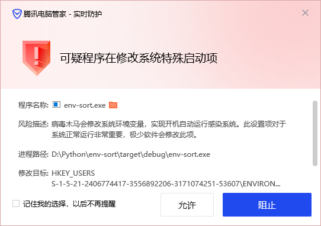

Env Sort
=====================

强迫症福音, 帮你的环境变量排序

1. 排序环境变量
2. 用户态和系统态分开
3. 删除失效的 PATH 变量
4. PATH 大小写改正成实际路径的大小写

---

- 排序前

- 排序后

一本满足

## Execute

先跑但是不写入, 没问题了再实际写入.

首次运行可能触发你电脑上的杀毒软件, 比如这样:

这是因为 Windows 的环境变量在注册表里, 直接点允许即可.

## Verify

检查并清除失效字段, 支持解析动态路径 `%var%`.